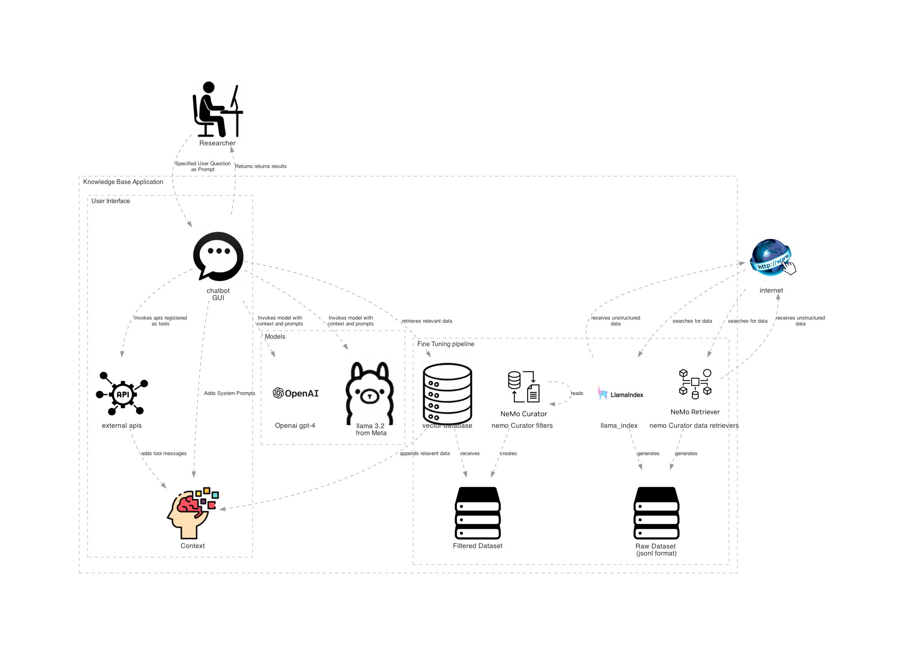

# Application Architecture and Infrastructure Management

## Application Architecture
The following presents a typical GEN AI application Architecture.



## Infrastructure
This section documents the infrastructure management

Infrastructure As Code model.  Using Terraform to manage infrastructure provisioned on AWS lambda, AWS API Gateway and AWS Fargate.


## Baseline Development Infrastructure
### Repo Security

This link presents my evaluation of github hooks for [secret scanning](./doc/security/REPO-SECURITY-README.md). I'm going to use this as a starting point for protecting myself from accidentally deploying secrets or tokens to my repos.

## Integrate secrets to your application
### Building a .env File for Password Management

To manage passwords and other sensitive information securely, you can use a `.env` file. This file will store your environment variables, which can then be accessed by your application.

1. **Create a `.env` File**: In the root directory of your project, create a file named `.env`.

2. **Add Environment Variables**: Add your passwords and other sensitive information as key-value pairs in the `.env` file. For example:

    ```plaintext
    DB_PASSWORD=your_database_password
    API_KEY=your_api_key
    ```

3. **Load Environment Variables**: Use a library to load the environment variables from the `.env` file into your application. For example, in a Python application, you can use the `python-dotenv` library:

    ```python
    from dotenv import load_dotenv
    import os

    load_dotenv()

    db_password = os.getenv('DB_PASSWORD')
    api_key = os.getenv('API_KEY')
    ```

4. **Secure the `.env` File**: Ensure that your `.env` file is not committed to version control by adding it to your `.gitignore` file:

    ```plaintext
    .env
    ```

By following these steps, you can securely manage passwords and other sensitive information in your application.


### Sharing Secrets with AWS Copilot

AWS Copilot simplifies the process of sharing secrets with your applications. You can securely store and manage secrets using AWS Secrets Manager and reference them in your Copilot applications.

1. **Store Secrets in AWS Secrets Manager**: First, store your secrets in AWS Secrets Manager. You can do this via the AWS Management Console, AWS CLI, or AWS SDKs.

2. **Reference Secrets in Copilot**: Update your Copilot manifest file to include the secrets. For example, in your `manifest.yml`:

    ```yaml
    secrets:
      MY_SECRET: arn:aws:secretsmanager:region:account-id:secret:my-secret
    ```

3. **Access Secrets in Your Application**: In your application code, access the secrets using environment variables. For example, in a Python application:

    ```python
    import os

    my_secret = os.getenv('MY_SECRET')
    ```

For more details, refer to the [AWS Copilot documentation](https://aws.github.io/copilot-cli/docs/developing/secrets/).

## Identity management
When I deploy to the cloud I'd like to ensure that I have a good identity management strategy.  

When running an application on AWS fargate, AWS Cognito and AWS Amplify help to setup a secure login to your application.  

### AWS Amplify
[AWS Amplify](./infrastructure/aws/identity/amplify.md) 

### AWS Cognito
[AWS Cognito](./infrastructure/aws/identity/cognito.md)

### Securing applications with Spring Security
[Spring Security](./tools/code/frameworks/spring-security.md) is a powerful and highly customizable authentication and access-control framework. It is the de-facto standard for securing Spring-based applications.

# Tracing Gen AI Requests
To trace requests in a Gen AI application, you can use distributed tracing tools like AWS X-Ray, Jaeger, or Zipkin. These tools help you monitor and trace requests as they flow through your application, providing insights into performance, errors, and bottlenecks.

Also langsmith provides a tracing tool called LlamaTrace.  LlamaTrace is a tracing tool that helps you monitor and trace requests in your Gen AI application. It provides detailed insights into request flows, performance metrics, and error tracking, enabling you to optimize your application for better performance and reliability.
