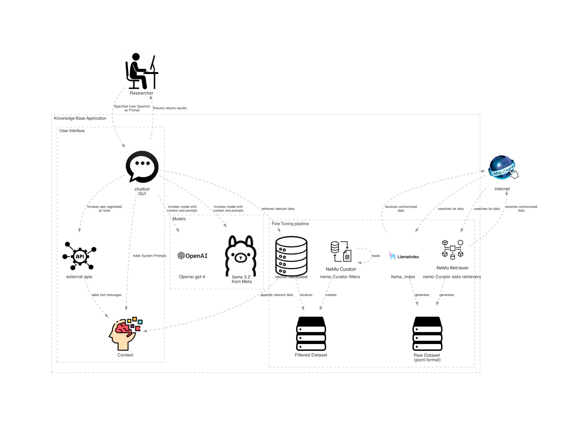

**Fine Tuning**

Fine-tuning a Large Language Model (LLM) involves adapting a pre-trained model to a specific task or domain by training it further on a smaller, task-specific dataset. This process helps the model to:

- Improve performance on specific tasks by learning domain-specific patterns and nuances.
- Reduce errors and increase accuracy in generating relevant and contextually appropriate responses.
- Enhance the model's ability to understand and generate text that aligns with the desired output for the given application.

Fine-tuning is essential for customizing general-purpose models to meet the unique requirements of specialized applications, such as providing detailed product information in this case.

### Common Tools used
python, [langchain](./tools/code/ai/langchain.md), llama-index, nvidia NEMO Curator, [Pydantic](./tools/code/language/python/pydantic.md) to convert unstructured data into structured dataset
