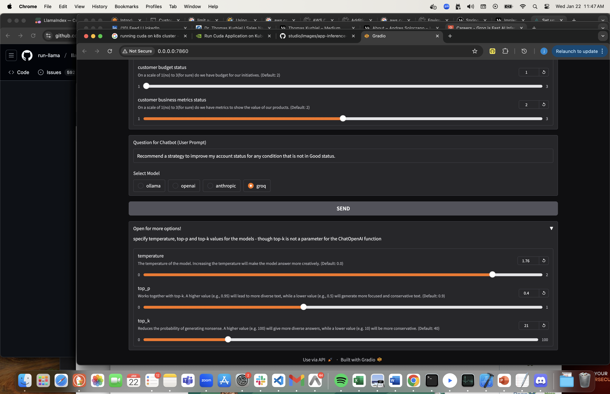

My account plan demo app takes input in a number of categories about the current state of the account and suggests a strategy for state variables that are less than ideal. It's a very simple generative AI application, laying the groundwork for something more complicated later.

Built with Python and Gradio to leverage langchain libraries for llama 3.2 and openai gpt 4 functional models on my laptop.    

Currently, this is a pilot that runs on my macbook pro and deploys on AWS fargate, look forward to the  following improvements:

1. require a login with AWS Cognito on AWS deployments
2. make the application multi-tenanted to allow multiple users to use it simultaneously
4. add additional foundation models to the application

Here's a few screenshots showing how the account planning application works:

1. Specify the current state of the account and update the prompt with what ever you think is useful

2. Specify Chat parameters to influence the token processing

3. submit your request

4. get your results

