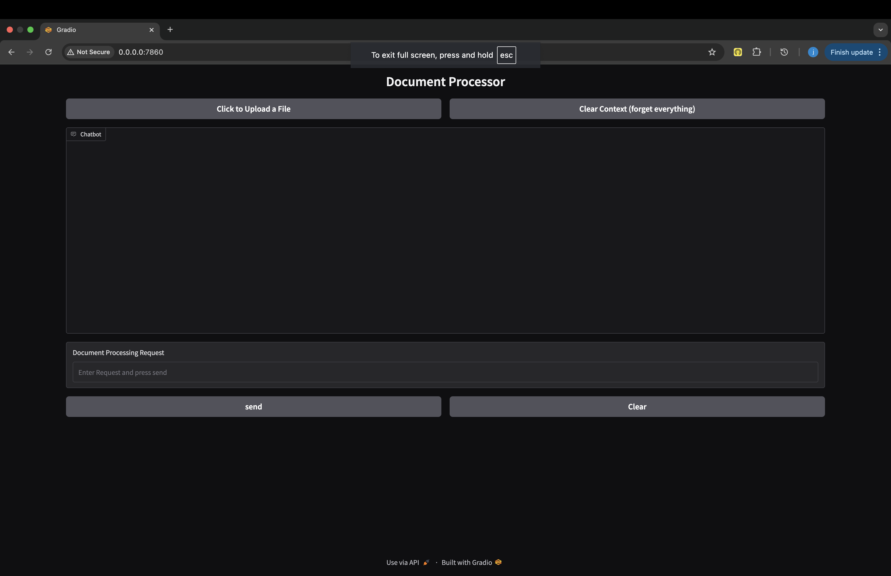
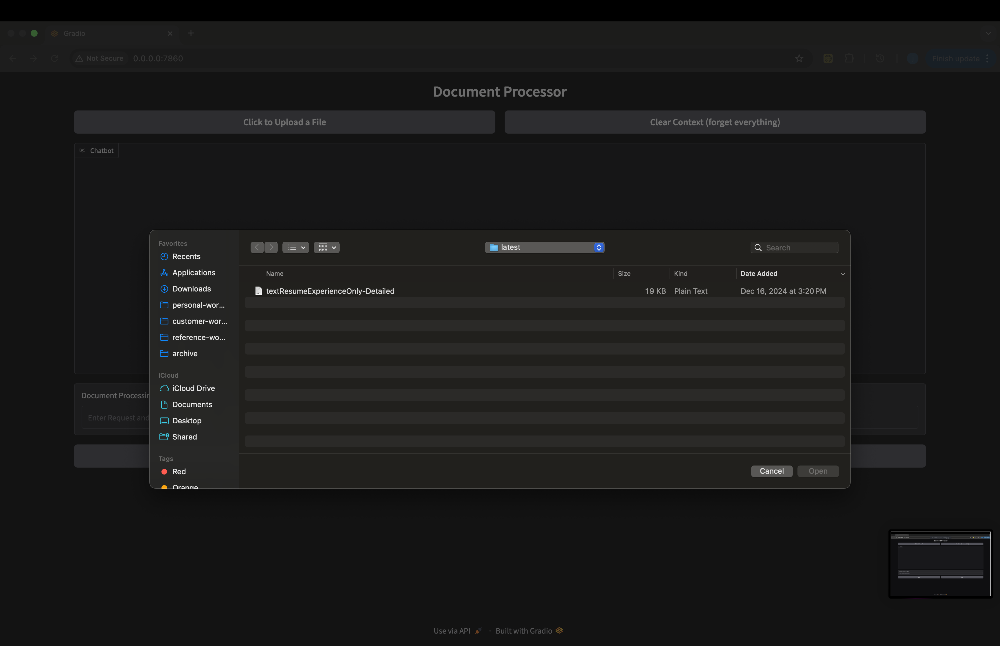
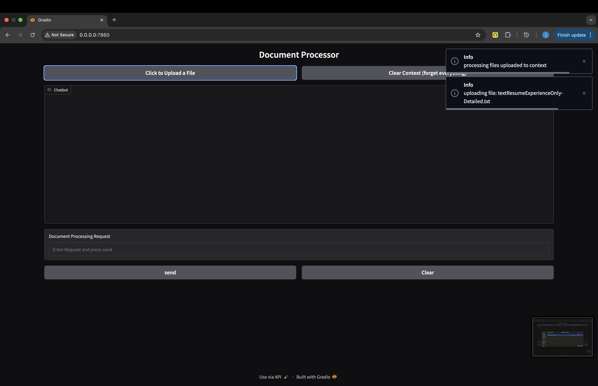
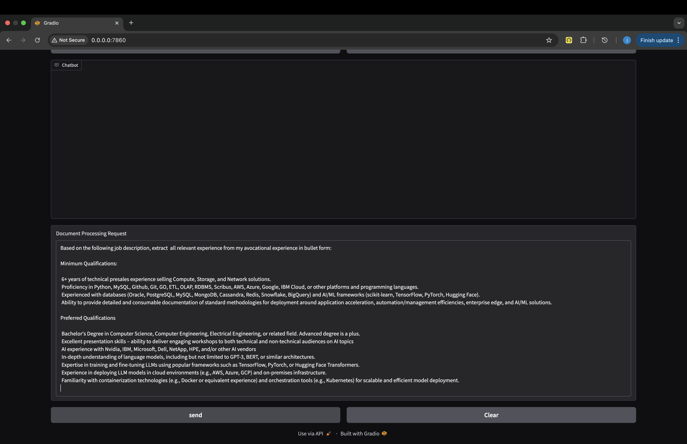
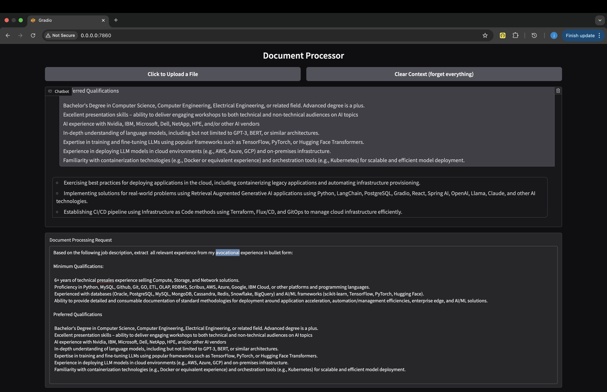

This Retrieval Augmented Generation App allows the user to load a document into an in memory vector database and then ask OpenAI to use it in a conversation. The user can ask questions about the document and the app will return the answer. The user can also ask the app to generate a summary of the document.

The following is a quick little example of the app to load a very detailed copy of a resume and then compare it to a job description.   By prompting it to extract and enhance specific experience from the resume it can be used it to answer questions about the experience and to generate a cover letter highlighting relevant experience.

The app currently runs on a macbook pro, in the future the following updates are planned:

1. require a login
2. make it multi-tenanted
3. update it to use other functional models
4. run it on the cloud
5. update it to use other vector database products

Here's a screenshot of the initial UI:

Here's a screenshot of the application selecting a document to load:

This screenshot shows the status as it loads the document;

In this screenshot, I add the job description and instructions in a user prompt:

Finally, this screenshot shows the response to the request:

