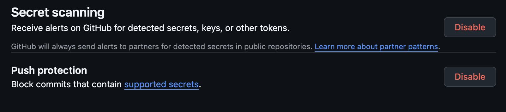
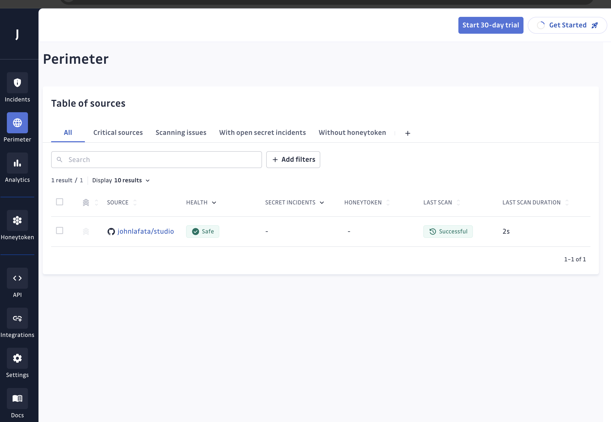

In order to make sure I don't accidentally commit any secrets to this repo, so I'm going to explore how to use git-secrets to prevent that.

### git secrets
This is a tool that scans to make sure AWS credentials are not in a repository.

[See more of my exercise with git-secrets here.](../../tools/code/secrets/gitSecrets.md)

So git-secrets is great, it scans and finds AWS related secrets by default, but I really want a more comprehensive scan, which would require me to add more patterns to scan for.  I'll be looking for common credential patterns to add to this.

I'm also looking at this to see if this is an even better solution.

https://docs.github.com/en/code-security/secret-scanning/introduction/about-push-protection

Turns out that secret scanning and push protection are enabled by default if you create a public git repo.  

----
### git leaks
I also found this tool [gitleaks](../../tools/code/secrets/gitLeaks.md) which seems to identify other common credential patterns.     This [documentation](https://www.jit.io/resources/appsec-tools/the-developers-guide-to-using-gitleaks-to-detect-hardcoded-secrets) says it can be installed as a hook, but I can't seem to be able to do that.

---
### gitguardian
Another tool worth evaluating is [gitguardian](https://www.gitguardian.com/).

GitGuardian installs as an application in your source code management system, in my case, github.com.  It then provides access to a dashboard to add repositories. 

https://dashboard.gitguardian.com/workspace/[MY_WORKSPACE_ID]/settings/workspace/general 

It includs a pre-commit hook preventing secrets if you install it with these [instructions](https://docs.gitguardian.com/ggshield-docs/integrations/git-hooks/pre-commit).  It has a free plan which is what I'm using for now, but also includes a business and enterprise level plan which allow for larger repository scanning size.