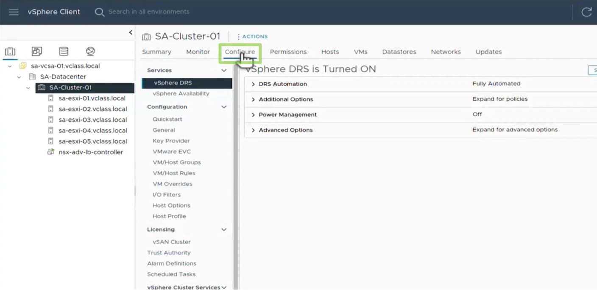

# configure HA/DRS (fully automated) 
## VSAN Stretched Cluster with HA/DRS Benefits

A VSAN stretched cluster with properly configured HA (High Availability) and DRS (Distributed Resource Scheduler) provides significant resilience and operational benefits:

### Disaster Recovery & Business Continuity
- Geographic redundancy across data centers
- Automatic failover during site outages
- RPO (Recovery Point Objective) of zero with synchronous replication
- Near-zero RTO (Recovery Time Objective) with automatic VM restart

### Availability Benefits
- Protection against host, network, and site failures
- Automatic VM restart on surviving hosts
- No single point of failure across infrastructure
- Minimal downtime during planned maintenance

### Resource Optimization
- Automated initial VM placement based on resource requirements
- Dynamic workload balancing across available hosts
- Resource reservation capabilities for critical workloads
- Automatic migration of VMs from overloaded hosts

### Operational Efficiency
- Unified management of multiple physical sites
- Simplified disaster recovery testing and validation
- Reduced operational complexity compared to traditional DR
- Centralized policy management

### Performance Considerations
- Witness host/appliance ensures quorum during failures
- Network latency between sites affects performance (typically <5ms RTT required)
- Storage policies control redundancy and failure tolerance
- Intelligent placement of VMs based on resource requirements

