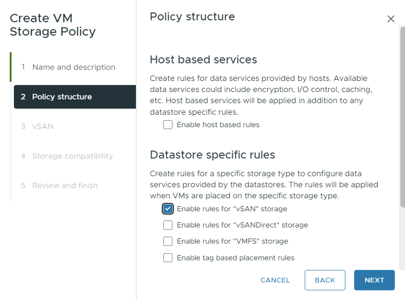

# Storage Policy Configuration

vks on a stretched cluster requires a storage policy to be created and applied to the vSAN datastore. This policy is used to ensure that the Kubernetes control plane and workloads are deployed with the appropriate storage settings for high availability and performance.

