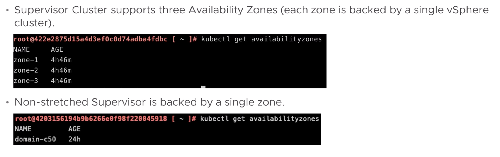

# Availability Zones

VKS supports 1 and 3 zone configurations. The number of zones you can use depends on the number of hosts in your vSAN stretched cluster.

Both implementations of VKS (Avi Load Balancer and HA Proxy) support 1 and 3 zone configurations.  1 zone is referred to as a cluster deployment 3 zones is referred to as a zonal deployment.

The implementations I was part of both deployed a 1 zone or cluster deployment. This is the simplest configuration and is suitable for many use cases.

