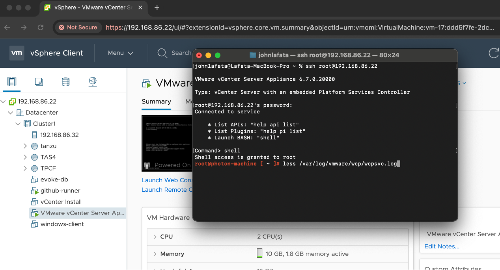

# Troubleshooting References for Tanzu Kubernetes Service (TKG) on vSphere

[Supervisor Troubleshooting](https://github.com/vsphere-tmm/vsphere-supervisor/blob/main/supervisor-troubleshooting.md) 

[VKS troubleshooting](https://github.com/vsphere-tmm/vsphere-supervisor/blob/main/vks-troubleshooting.md)

[Pull Logs to Troubleshoot VKS Clusters on Supervisor](https://techdocs.broadcom.com/us/en/vmware-cis/vcf/vsphere-supervisor-services-and-standalone-components/latest/managing-vsphere-kuberenetes-service-clusters-and-workloads/troubleshooting-tkg-service-clusters/pull-logs-to-troubleshoot-tkg-clusters.html)

To troubleshoot issues with Tanzu Kubernetes Service (TKG) clusters on vSphere, you can pull logs from the Supervisor Cluster. This is essential for diagnosing problems related to cluster provisioning, node management, and other operational aspects.

[Troubleshooting VKS Clusters](https://techdocs.broadcom.com/us/en/vmware-cis/vcf/vsphere-supervisor-services-and-standalone-components/latest/managing-vsphere-kuberenetes-service-clusters-and-workloads/troubleshooting-tkg-service-clusters/check-the-health-of-tkg-components.html#:~:text=VKS%20Cluster%20Workloads-,Troubleshooting%20VKS%20Clusters,-Pull%20Logs%20to)

[Troubleshoot VKS Cluster Provisioning Errors](https://techdocs.broadcom.com/us/en/vmware-cis/vcf/vsphere-supervisor-services-and-standalone-components/latest/managing-vsphere-kuberenetes-service-clusters-and-workloads/troubleshooting-tkg-service-clusters/troubleshoot-tkg-cluster-provisioning-errors.html)

[Upgrade vSphere Kubernetes Cluster Stuck](https://knowledge.broadcom.com/external/article/386651/vsphere-kubernetes-cluster-upgrade-stuck.html)

### notes
* kubectl is not installed in vcsa by default
* To interact with the Supervisor Cluster (which is part of vSphere with Tanzu), you also need to install the vSphere Plugin for kubectl.
* The vSphere Plugin allows you to authenticate with the Supervisor Cluster using your vCenter Single Sign-On credentials.
* You can download both kubectl and the vSphere Plugin from the Supervisor Cluster control plane. 
